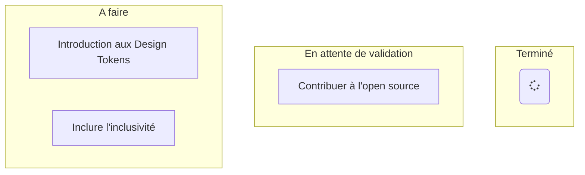

# BDX-IO-2022-SOUS-TITRE

Suite à la conférence BDX I/O du vendredi 02 décembre et plus particlièrement suite au talk de Anne-Laure Gaillard : <q>Contribuer à l'Open Source ? Yes, you can!</q> (à revoir sur YouTube https://www.youtube.com/watch?v=gyhR5m4RgyE),
je vous propose de toutes et tous de participer à la communauté en prenant un peu de temps pour écrire les sous-titres des vidéos.

Comme, nous le présise Anne-Laure dans sa présentation :
<blockquote>
Alors pourquoi est-ce qu'on contribue à l'Open Source ?  
[...] 
C'est, à priori, d'après en tout cas ce livre "La vérité sur ce qui nous motive" de Daniel Pick, c'est pour de l'altruisme. 
Parce qu'en fait vous avez envie de rendre à la communauté quelque chose et le fait qu'elle vous aide vous avez aussi envie de l'aider à votre tour.
</blockquote>

Un petit plus, n'oublions pas que avoir des sous-titres propres, et des transcriptions textuelles, peut-être utile pour tout le monde et notammenet aider les personnes 
en situation d'handicap par exemple.

## Arboresence
* `autogenere` : répertoire contenant les sous-titres auto-générés des talks. La génération est réalisée via DownSub.com, l'url `https://subtitle.to/{lien YouTube}` (exemple https://subtitle.to/www.youtube.com/watch?v=gyhR5m4RgyE)
* `final` : sous-titre des talks dans leur version finale

## Avancement

## Liste des conférences
* <q>Contribuer à l'Open Source ? Yes, you can!</q> - Anne-Laure Gaillard
  * Etat : `En attente de validation speaker`
  * Vidéo Youtube : https://www.youtube.com/watch?v=gyhR5m4RgyE
  * [Fichier sous-titre ./final/contributer-open-source.srt](./final/contributer-open-source.srt)

* <q>Introduction aux Design Tokens</q> - François Garrigues
  * Etat : `Autogeneré`
  * Vidéo Youtube : https://www.youtube.com/watch?v=7BoFBcrXY1g
  * fichier autogéné : [autogenere/introduction-aux-design-tokens.srt](autogenere/introduction-aux-design-tokens.srt)

* <q>Comment inclure l’inclusivité dès les premières étapes de conception d'un service ou d'un produit digital</q> - Noémie M. Rivière
  * Etat : `autogénéré`
  * Vidéo youtube : https://www.youtube.com/watch?v=KNlVkRs9a94&t=243s
  * Fichier autogénéré : [./autogenere/comment-inclure-l-inclusitie-des-les-premieres-etates.srt](./autogenere/comment-inclure-l-inclusitie-des-les-premieres-etates.srt)
