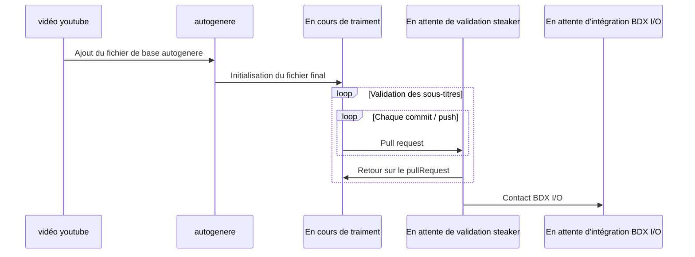

# BDX-IO-2022-SOUS-TITRE

Suite à la conférence BDX I/O du vendredi 02 décembre et plus particlièrement suite au talk de Anne-Laure Gaillard : <q>Contribuer à l'Open Source ? Yes, you can!</q> (à revoir sur YouTube https://www.youtube.com/watch?v=gyhR5m4RgyE),
je vous propose de toutes et tous de participer à la communauté en prenant un peu de temps pour écrire les sous-titres des vidéos.

Comme, nous le présise Anne-Laure dans sa présentation :
<blockquote>
Alors pourquoi est-ce qu'on contribue à l'Open Source ?  
[...] 
C'est, à priori, d'après en tout cas ce livre "La vérité sur ce qui nous motive" de Daniel Pick, c'est pour de l'altruisme. 
Parce qu'en fait vous avez envie de rendre à la communauté quelque chose et le fait qu'elle vous aide vous avez aussi envie de l'aider à votre tour.
</blockquote>

Un petit plus, n'oublions pas que avoir des sous-titres propres, et des transcriptions textuelles, peut-être utile pour tout le monde et notammenet aider les personnes 
en situation d'handicap par exemple.

## Arboresence
* `autogenere` : répertoire contenant les sous-titres auto-générés des talks. La génération est réalisée via DownSub.com, l'url `https://subtitle.to/{lien YouTube}` (exemple https://subtitle.to/www.youtube.com/watch?v=gyhR5m4RgyE)
* `final` : sous-titre des talks dans leur version finale

## Processus de validation

## Liste des conférences
* [x] <q>Contribuer à l'Open Source ? Yes, you can!</q> - Anne-Laure Gaillard 

En savoir plus https://github.com/Noirtam/BDX-IO-2022-SOUS-TITRE/labels/YouTube

  * Etat : https://github.com/Noirtam/BDX-IO-2022-SOUS-TITRE/labels/YouTube
  * Vidéo Youtube : https://www.youtube.com/watch?v=gyhR5m4RgyE
  * [Fichier sous-titre français ./final/contributer-open-source.srt](./final/contributer-open-source.srt)

* [ ] <q>Introduction aux Design Tokens</q> - François Garrigues 

En savoir plus https://github.com/Noirtam/BDX-IO-2022-SOUS-TITRE/labels/autogenere

  * Etat : https://github.com/Noirtam/BDX-IO-2022-SOUS-TITRE/labels/autogenere
  * Vidéo Youtube : https://www.youtube.com/watch?v=7BoFBcrXY1g
  * fichier autogéné : [autogenere/introduction-aux-design-tokens.srt](autogenere/introduction-aux-design-tokens.srt)

* [ ] <q>Comment inclure l’inclusivité dès les premières étapes de conception d'un service ou d'un produit digital</q> - Noémie M. Rivière

En savoir plus https://github.com/Noirtam/BDX-IO-2022-SOUS-TITRE/labels/autogenere

  * Etat : https://github.com/Noirtam/BDX-IO-2022-SOUS-TITRE/labels/autogenere
  * Vidéo youtube : https://www.youtube.com/watch?v=KNlVkRs9a94
  * Fichier autogénéré : [./autogenere/comment-inclure-l-inclusitie-des-les-premieres-etates.srt](./autogenere/comment-inclure-l-inclusitie-des-les-premieres-etates.srt)

* [ ] <q>Syndrome de l'Imposteur, l'arbre qui cache la forêt</q> - Boris Schapira

En savoir plus https://github.com/Noirtam/BDX-IO-2022-SOUS-TITRE/labels/En%20cours%20de%20traitement

  * Vidéo youtube : https://www.youtube.com/watch?v=vS2WKdWRNqo
  * Fichier autogénéré : [./autogenere/syndrome-de-l-imposteur-l-arbre-qui-cache-la-foret.srt](./autogenere/syndrome-de-l-imposteur-l-arbre-qui-cache-la-foret.srt)

* [ ] <q>Rendez l’agilité aux développeur·se·s !</q> - Fanny Klauk

En savoir plus https://github.com/Noirtam/BDX-IO-2022-SOUS-TITRE/labels/autogenere

  * Etat : https://github.com/Noirtam/BDX-IO-2022-SOUS-TITRE/labels/autogenere
  * Vidéo youtube : https://www.youtube.com/watch?v=Ib2uoz2JTeY
  * Fichier autogénéré : [./autogenere/rendez-l-agilite-aux-developpeur·se·s.srt](./autogenere/rendez-l-agilite-aux-developpeur·se·s.srt)

  
* [ ] <q>Mon application en Serverless</q> - Marie Minasyan

En savoir plus https://github.com/Noirtam/BDX-IO-2022-SOUS-TITRE/labels/autogenere

  * Etat : https://github.com/Noirtam/BDX-IO-2022-SOUS-TITRE/labels/autogenere
  * Vidéo youtube : https://www.youtube.com/watch?v=8kGkIlcaV0Q
  * Fichier autogénéré : [./autogenere/mon-application-en-serverless.srt](./autogenere/mon-application-en-serverless.srt)

* [ ] <q>Test me up, before you Go-Go</q> - Nicolas Comet

En savoir plus https://github.com/Noirtam/BDX-IO-2022-SOUS-TITRE/labels/autogenere

  * Etat : https://github.com/Noirtam/BDX-IO-2022-SOUS-TITRE/labels/autogenere
  * Vidéo youtube : https://www.youtube.com/watch?v=8wguarCwSII
  * Fichier autogénéré : [./autogenere/test-me-up-before-you-Go-Go.srt](./autogenere/test-me-up-before-you-Go-Go.srt)

* [ ] <q>1 2 3 ce sera toi le Scrum Master </q> - Fanny Klauk

En savoir plus https://github.com/Noirtam/BDX-IO-2022-SOUS-TITRE/labels/autogenere

  * Fichier autogénéré : [./autogenere/1_2_3_ce_sera_toi_le_Scrum_Master_-_Fanny_Klauk.fr-orig.srt](./autogenere/1_2_3_ce_sera_toi_le_Scrum_Master_-_Fanny_Klauk.fr-orig.srt)
  

* [ ] <q>Abstraire mon architecture distribuee Pourquoi et Comment </q> - Vivien Maleze

En savoir plus https://github.com/Noirtam/BDX-IO-2022-SOUS-TITRE/labels/autogenere

  * Fichier autogénéré : [./autogenere/Abstraire_mon_architecture_distribuee_Pourquoi_et_Comment_-_Vivien_Maleze.fr-orig.srt](./autogenere/Abstraire_mon_architecture_distribuee_Pourquoi_et_Comment_-_Vivien_Maleze.fr-orig.srt)
  

* [ ] <q>Alice au pays d Opentelemetry </q> - Jerome Tama

En savoir plus https://github.com/Noirtam/BDX-IO-2022-SOUS-TITRE/labels/autogenere

  * Fichier autogénéré : [./autogenere/Alice_au_pays_d_Opentelemetry_-_Jerome_Tama.fr-orig.srt](./autogenere/Alice_au_pays_d_Opentelemetry_-_Jerome_Tama.fr-orig.srt)

* [ ] <q>Ameliorer sa performance web grace aux strategies d hydratation R... </q> - Valentin Colmant

En savoir plus https://github.com/Noirtam/BDX-IO-2022-SOUS-TITRE/labels/autogenere

  * Fichier autogénéré : [./autogenere/Ameliorer_sa_performance_web_grace_aux_strategies_d_hydratation_R..._-_Valentin_Colmant.fr-orig.srt](./autogenere/Ameliorer_sa_performance_web_grace_aux_strategies_d_hydratation_R..._-_Valentin_Colmant.fr-orig.srt)

* [ ] <q>Comment debuter dans l accessibilite numerique </q> - Emmanuelle Aboaf

En savoir plus https://github.com/Noirtam/BDX-IO-2022-SOUS-TITRE/labels/autogenere

  * Fichier autogénéré : [./autogenere/Comment_debuter_dans_l_accessibilite_numerique_-_Emmanuelle_Aboaf.fr-orig.srt](./autogenere/Comment_debuter_dans_l_accessibilite_numerique_-_Emmanuelle_Aboaf.fr-orig.srt)

* [ ] <q>Comment economiser de l argent et donc du CO2 avec Azure </q> - Eddy Montus

En savoir plus https://github.com/Noirtam/BDX-IO-2022-SOUS-TITRE/labels/autogenere

  * Fichier autogénéré : [./autogenere/Comment_economiser_de_l_argent_et_donc_du_CO2_avec_Azure_-_Eddy_Montus.fr-orig.srt](./autogenere/Comment_economiser_de_l_argent_et_donc_du_CO2_avec_Azure_-_Eddy_Montus.fr-orig.srt)

* [ ] <q>Comment j ai aide ma fille a lire avec le machine learning </q> - Vincent Ogloblinsky

En savoir plus https://github.com/Noirtam/BDX-IO-2022-SOUS-TITRE/labels/autogenere

  * Fichier autogénéré : [./autogenere/Comment_j_ai_aide_ma_fille_a_lire_avec_le_machine_learning_-_Vincent_Ogloblinsky.fr-orig.srt](./autogenere/Comment_j_ai_aide_ma_fille_a_lire_avec_le_machine_learning_-_Vincent_Ogloblinsky.fr-orig.srt)

* [ ] <q>Comment je suis devenue Data Scientiste en revenant d un tour du mon... </q> - Alice Peltier

En savoir plus https://github.com/Noirtam/BDX-IO-2022-SOUS-TITRE/labels/autogenere

  * Fichier autogénéré : [./autogenere/Comment_je_suis_devenue_Data_Scientiste_en_revenant_d_un_tour_du_mon..._-_Alice_Peltier.fr-orig.srt](./autogenere/Comment_je_suis_devenue_Data_Scientiste_en_revenant_d_un_tour_du_mon..._-_Alice_Peltier.fr-orig.srt)

* [ ] <q>Comment permettre 100 millions de logins sans i... </q> - Nicolas Jozwiak Etienne Puissant

En savoir plus https://github.com/Noirtam/BDX-IO-2022-SOUS-TITRE/labels/autogenere

  * Fichier autogénéré : [./autogenere/Comment_permettre_100_millions_de_logins_sans_i..._-_Nicolas_Jozwiak_Etienne_Puissant.fr-orig.srt](./autogenere/Comment_permettre_100_millions_de_logins_sans_i..._-_Nicolas_Jozwiak_Etienne_Puissant.fr-orig.srt)

* [ ] <q>Cryptanalyse de la machine Enigma </q> - entre espionnage et math... - Jean-Christophe Sirot

En savoir plus https://github.com/Noirtam/BDX-IO-2022-SOUS-TITRE/labels/autogenere

  * Fichier autogénéré : [./autogenere/Cryptanalyse_de_la_machine_Enigma_-_entre_espionnage_et_math..._-_Jean-Christophe_Sirot.fr-orig.srt](./autogenere/Cryptanalyse_de_la_machine_Enigma_-_entre_espionnage_et_math..._-_Jean-Christophe_Sirot.fr-orig.srt)

* [ ] <q>De pionnieres a oubliees l histoire des femme... </q> - Charline Laporte Manon Valdonio

En savoir plus https://github.com/Noirtam/BDX-IO-2022-SOUS-TITRE/labels/autogenere

  * Fichier autogénéré : [./autogenere/De_pionnieres_a_oubliees_l_histoire_des_femme..._-_Charline_Laporte_Manon_Valdonio.fr-orig.srt](./autogenere/De_pionnieres_a_oubliees_l_histoire_des_femme..._-_Charline_Laporte_Manon_Valdonio.fr-orig.srt)

* [ ] <q>Deep Learning en Python </q> - comment choisir un framework - Justine Bel-Letoile

En savoir plus https://github.com/Noirtam/BDX-IO-2022-SOUS-TITRE/labels/autogenere

  * Fichier autogénéré : [./autogenere/Deep_Learning_en_Python_-_comment_choisir_un_framework_-_Justine_Bel-Letoile.fr-orig.srt](./autogenere/Deep_Learning_en_Python_-_comment_choisir_un_framework_-_Justine_Bel-Letoile.fr-orig.srt)

* [ ] <q>Drogue a l hexagone Node JS ne m a pas vraiment aide a rester cl... </q> - Nicolas Giraud

En savoir plus https://github.com/Noirtam/BDX-IO-2022-SOUS-TITRE/labels/autogenere

  * Fichier autogénéré : [./autogenere/Drogue_a_l_hexagone_Node_JS_ne_m_a_pas_vraiment_aide_a_rester_cl..._-_Nicolas_Giraud.fr-orig.srt](./autogenere/Drogue_a_l_hexagone_Node_JS_ne_m_a_pas_vraiment_aide_a_rester_cl..._-_Nicolas_Giraud.fr-orig.srt)

* [ ] <q>Et s il suffisait de documenter pour tester </q> - Sebastien Fauvel

En savoir plus https://github.com/Noirtam/BDX-IO-2022-SOUS-TITRE/labels/autogenere

  * Fichier autogénéré : [./autogenere/Et_s_il_suffisait_de_documenter_pour_tester_-_Sebastien_Fauvel.fr-orig.srt](./autogenere/Et_s_il_suffisait_de_documenter_pour_tester_-_Sebastien_Fauvel.fr-orig.srt)

* [x] <q>Gestion de la dette d architecture dans un contexte d hypercroissance </q> - Cyril Beslay

En savoir plus https://github.com/Noirtam/BDX-IO-2022-SOUS-TITRE/labels/autogenere

  * [Fichier sous-titre français ./final/Gestion_de_la_dette_d_architecture_dans_un_contexte_d_hypercroissance_-_Cyril_Beslay.fr.srt](./final/Gestion_de_la_dette_d_architecture_dans_un_contexte_d_hypercroissance_-_Cyril_Beslay.fr.srt)

* [ ] <q>Introduction au DevSecOps </q> - Arthur Havlicek

En savoir plus https://github.com/Noirtam/BDX-IO-2022-SOUS-TITRE/labels/autogenere

  * Fichier autogénéré : [./autogenere/Introduction_au_DevSecOps_-_Arthur_Havlicek.fr-orig.srt](./autogenere/Introduction_au_DevSecOps_-_Arthur_Havlicek.fr-orig.srt)

* [ ] <q>Keynote de fermeture </q> - La pensee visuelle a change ma vie

En savoir plus https://github.com/Noirtam/BDX-IO-2022-SOUS-TITRE/labels/autogenere

  * Fichier autogénéré : [./autogenere/Keynote_de_fermeture_-_La_pensee_visuelle_a_change_ma_vie.fr-orig.srt](./autogenere/Keynote_de_fermeture_-_La_pensee_visuelle_a_change_ma_vie.fr-orig.srt)

* [ ] <q>La recommandation de contenu a portee de mains </q> - Paul Breton

En savoir plus https://github.com/Noirtam/BDX-IO-2022-SOUS-TITRE/labels/autogenere

  * Fichier autogénéré : [./autogenere/La_recommandation_de_contenu_a_portee_de_mains_-_Paul_Breton.fr-orig.srt](./autogenere/La_recommandation_de_contenu_a_portee_de_mains_-_Paul_Breton.fr-orig.srt)

* [ ] <q>Le numerique c est pour tout le monde... ou pas </q> - Iris Naudin Cecile Freyd-Foucault

En savoir plus https://github.com/Noirtam/BDX-IO-2022-SOUS-TITRE/labels/autogenere

  * Fichier autogénéré : [./autogenere/Le_numerique_c_est_pour_tout_le_monde..._ou_pas_-_Iris_Naudin_Cecile_Freyd-Foucault.fr-orig.srt](./autogenere/Le_numerique_c_est_pour_tout_le_monde..._ou_pas_-_Iris_Naudin_Cecile_Freyd-Foucault.fr-orig.srt)

* [ ] <q>Les sciences cognitives au service de l accessibilite web. </q> - Margot Bouhon

En savoir plus https://github.com/Noirtam/BDX-IO-2022-SOUS-TITRE/labels/autogenere

  * Fichier autogénéré : [./autogenere/Les_sciences_cognitives_au_service_de_l_accessibilite_web._-_Margot_Bouhon.fr-orig.srt](./autogenere/Les_sciences_cognitives_au_service_de_l_accessibilite_web._-_Margot_Bouhon.fr-orig.srt)

* [ ] <q>Pourquoi vous n attirerez et ne retiendrez pas les femmes dans vos equipes tech</q> - 

En savoir plus https://github.com/Noirtam/BDX-IO-2022-SOUS-TITRE/labels/autogenere

  * Fichier autogénéré : [./autogenere/Pourquoi_vous_n_attirerez_et_ne_retiendrez_pas_les_femmes_dans_vos_equipes_tech.fr-orig.srt](./autogenere/Pourquoi_vous_n_attirerez_et_ne_retiendrez_pas_les_femmes_dans_vos_equipes_tech.fr-orig.srt)

* [ ] <q>Property-based Testing ou l insuffisance des tests unitaires </q> - Sebastien Jaupart

En savoir plus https://github.com/Noirtam/BDX-IO-2022-SOUS-TITRE/labels/autogenere

  * Fichier autogénéré : [./autogenere/Property-based_Testing_ou_l_insuffisance_des_tests_unitaires_-_Sebastien_Jaupart.fr-orig.srt](./autogenere/Property-based_Testing_ou_l_insuffisance_des_tests_unitaires_-_Sebastien_Jaupart.fr-orig.srt)

* [ ] <q>Quelle est la place des introvertis dans une equipe agile </q> - Anais Huet

En savoir plus https://github.com/Noirtam/BDX-IO-2022-SOUS-TITRE/labels/autogenere

  * Fichier autogénéré : [./autogenere/Quelle_est_la_place_des_introvertis_dans_une_equipe_agile_-_Anais_Huet.fr-orig.srt](./autogenere/Quelle_est_la_place_des_introvertis_dans_une_equipe_agile_-_Anais_Huet.fr-orig.srt)

* [ ] <q>Record du monde </q> - Tour d horizon et cas d utilisation des records - Benoit Prioux

En savoir plus https://github.com/Noirtam/BDX-IO-2022-SOUS-TITRE/labels/autogenere

  * Fichier autogénéré : [./autogenere/Record_du_monde_-_Tour_d_horizon_et_cas_d_utilisation_des_records_-_Benoit_Prioux.fr-orig.srt](./autogenere/Record_du_monde_-_Tour_d_horizon_et_cas_d_utilisation_des_records_-_Benoit_Prioux.fr-orig.srt)

* [ ] <q>Remix </q> - le framework vraiment full stack - Cynthia Vo Van

En savoir plus https://github.com/Noirtam/BDX-IO-2022-SOUS-TITRE/labels/autogenere

  * Fichier autogénéré : [./autogenere/Remix_-_le_framework_vraiment_full_stack_-_Cynthia_Vo_Van.fr-orig.srt](./autogenere/Remix_-_le_framework_vraiment_full_stack_-_Cynthia_Vo_Van.fr-orig.srt)

* [ ] <q>Rendez les etats impossibles inatteignables dans vos frontends </q> - Benjamin Cavy

En savoir plus https://github.com/Noirtam/BDX-IO-2022-SOUS-TITRE/labels/autogenere

  * Fichier autogénéré : [./autogenere/Rendez_les_etats_impossibles_inatteignables_dans_vos_frontends_-_Benjamin_Cavy.fr-orig.srt](./autogenere/Rendez_les_etats_impossibles_inatteignables_dans_vos_frontends_-_Benjamin_Cavy.fr-orig.srt)

* [ ] <q>Still not into State Machines in 2023 </q> - Guillaume Amat

En savoir plus https://github.com/Noirtam/BDX-IO-2022-SOUS-TITRE/labels/autogenere

  * Fichier autogénéré : [./autogenere/Still_not_into_State_Machines_in_2023_-_Guillaume_Amat.fr-orig.srt](./autogenere/Still_not_into_State_Machines_in_2023_-_Guillaume_Amat.fr-orig.srt)

* [ ] <q>Surveiller ses impressions 3D avec un vieux smartphone du WebRT... </q> - Guillaume Laforge

En savoir plus https://github.com/Noirtam/BDX-IO-2022-SOUS-TITRE/labels/autogenere

  * Fichier autogénéré : [./autogenere/Surveiller_ses_impressions_3D_avec_un_vieux_smartphone_du_WebRT..._-_Guillaume_Laforge.fr-orig.srt](./autogenere/Surveiller_ses_impressions_3D_avec_un_vieux_smartphone_du_WebRT..._-_Guillaume_Laforge.fr-orig.srt)

* [ ] <q>Sustainable by design </q> - Yv Corbeil

En savoir plus https://github.com/Noirtam/BDX-IO-2022-SOUS-TITRE/labels/autogenere

  * Fichier autogénéré : [./autogenere/Sustainable_by_design_-_Yv_Corbeil.fr-orig.srt](./autogenere/Sustainable_by_design_-_Yv_Corbeil.fr-orig.srt)

* [ ] <q>Svelte ou pourquoi je ne veux plus faire de React </q> - Romain Crestey

En savoir plus https://github.com/Noirtam/BDX-IO-2022-SOUS-TITRE/labels/autogenere

  * Fichier autogénéré : [./autogenere/Svelte_ou_pourquoi_je_ne_veux_plus_faire_de_React_-_Romain_Crestey.fr-orig.srt](./autogenere/Svelte_ou_pourquoi_je_ne_veux_plus_faire_de_React_-_Romain_Crestey.fr-orig.srt)

* [ ] <q>Y en a marre du software craftsmanship </q> - Julien Topcu

En savoir plus https://github.com/Noirtam/BDX-IO-2022-SOUS-TITRE/labels/autogenere

  * Fichier autogénéré : [./autogenere/Y_en_a_marre_du_software_craftsmanship_-_Julien_Topcu.fr-orig.srt](./autogenere/Y_en_a_marre_du_software_craftsmanship_-_Julien_Topcu.fr-orig.srt)

